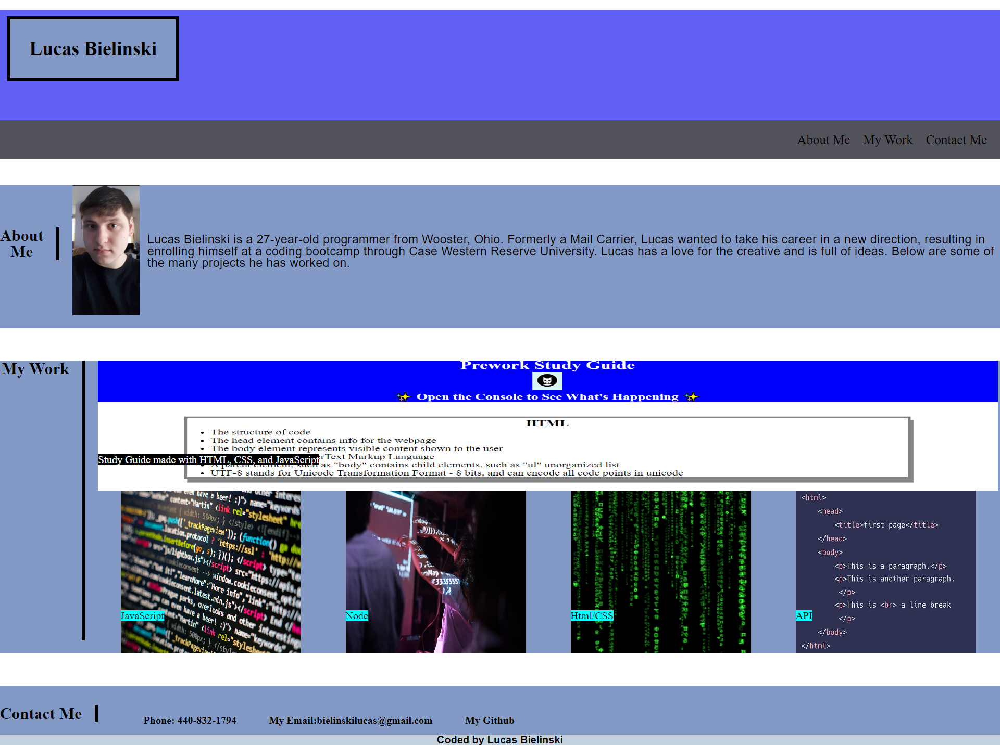

# Bielinski-Portfolio

## Description

This project is a place to display my deployed work, for future employers to look at. I built this project to make it possible to access my work in one place. This makes it quick and easy for a future employer to review my work. I learned how to use more advanced CSS methods in this project. I also learned that CSS is an art, and something I must keep experimenting with.

## Installation

N/A

## Usage

Clicking on the links towards the top of the page will bring you to a diffrent section of the page. Clicking on "About Me" will bring you to that section etc. Clicking on an image will take you to an external webpage. Clicking on the "My Github" link at the bottom, will take you to my Git Hub.

## Credits

Images were taken from Wikimedia Commons.
Images are by:
Jamie Zawinsk
Martin Vorel
Jun Yokoyama
Niraj Lokhande

## License

N/A
